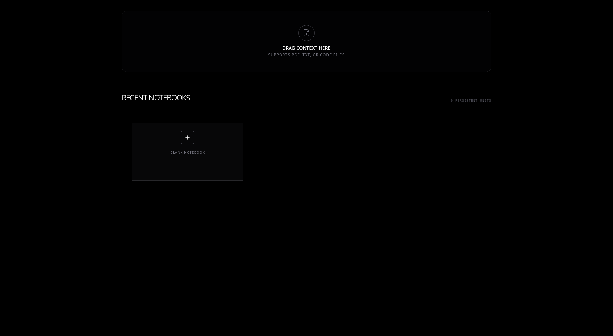

# Ollama Notebook

 

Ask AI about your documents for free and locally!

This project was made for people who want to use RAG systems without uploading their documents to third-party services like Google.

It runs completely **locally** using Ollama and a local LLM.

---

## ⚠️ Warning

> 🚧 **This project is still under development.**
>
> It is not production-ready and may contain bugs.
>
> ⚡ Depending on the size of the documents and the model being used, it can consume a significant amount of RAM and CPU.
>
> Use at your own risk.

---

## 🧠 How It Works

- You upload documents (TXT, PDF, etc.)
- The system generates embeddings
- It performs semantic (vector) search
- A local LLM (Phi-4 via Ollama) answers your questions using your documents as context

---

## 📦 Requirements

Before running the project, make sure you have:

- [Ollama](https://ollama.com/)
- Phi-4 model installed
- Bun installed
- Rust installed (required by Tauri)

---

## 🚀 Setup Guide

### 1️⃣ Install Ollama

Download and install Ollama from:

https://ollama.com/

---

### 2️⃣ Pull the Phi-4 model

```bash
ollama pull phi4
````

---

### 3️⃣ Start Ollama server

```bash
ollama serve
```

Keep this running in a separate terminal.

---

### 4️⃣ Clone the repository

```bash
git clone https://github.com/diegorezm/llm-notebook.git
cd llm-notebook
```

---

### 5️⃣ Install dependencies (using Bun)

```bash
bun install
```

---

### 6️⃣ Run the Tauri app in development mode

```bash
bun run tauri dev
```

---

## 🛠 Tech Stack

* Rust
* Tauri
* Bun
* SolidJS
